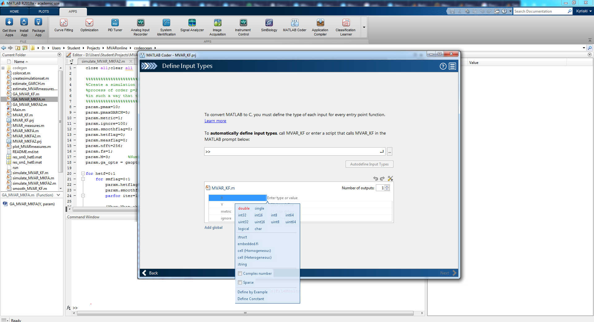

# Time Varying Multivariate Autoregressive (TV-MVAR) modeling  [1]
## Structure of the MatLab ToolBox
```
/ [root]
├── code
│   └── [matlab scripts]
│        Main.m
│        createsimulationset.m
│        MVAR_KF.m
│        MVAR_MKFA.m
│        MVAR_MKFA2.m
│        GA_MVAR_KF.m
│        GA_MVAR_MKFA.m
│        GA_MVAR_MKFA2.m
│        simulate_MVAR_KF.m
│        simulate_MVAR_MKFA.m
│        simulate_MVAR_MKFA2.m
│        smooth_MVAR_KF.m
│        smooth_MVAR_MKFA.m
│        smooth_MVAR_MKFA2.m
│        estimate_GARCH.m
│        estimate_MVARmeasures.m
│        MVAR_measures.m
│        plot_MVARmeasures.m
│        colorcet.m
│
│    └── mexhowto
│
├── data
     └── TVcoef.mat

```
```
- code contains the following:
  │
  ├── Main.m:                   The main function. A 3 dimensional TV-MVAR realization, driven by homoskedastic and heteroskedastic noise,   
  │                             is simulated. The TV model coefficients are saved on the folder data/TVcoef.mat. The coefficients were 
  │                             selected in such a way that the MVAR model was stable at each time point. The simulated process is then 
  │                             identified using recursive methods (conventional Kalman Filter and proposed Kalman Filter). The model and 
  │                             the recursive estimators hyperparameters are optimized using a mixed integer Genetic Algorithm (GA). TV-
  │                             MVAR measures of Coherence (COH), Partial Coherence (PCOH), Directed Coherence (DC) and Generalized 
  │                             Partial Directed Coherence (gPDC) are also computed and compared with the true simulated ones. For 
  |                             multiple realizations as shown in paper [1] the Main function code can be adapted easily
  │ 
  ├── createsimulationset.m:    This function creates a simulation realization of a 3 dimensional TV-MVAR process of order 2. The driving 
  │                             noise can be either homoskedastic or heteroskedastic (i.e. its variance is time-varying). The TV 
  │                             coefficients of the model (same as the ones depicted in Fig.1a of []) are save on the folder 
  │                             /data/TVcoef.mat
  │ 
  ├── MVAR_KF.m:                Function optimized by the GA for the case were the TV-MVAR coefficients are estimated using the 
  │                             conventional KF
  │
  ├── MVAR_MKFA.m:              Function optimized by the GA for the case were the TV-MVAR coefficients are estimated using the 
  │                             proposed KF (MKFA)
  │
  ├── MVAR_MKFA2.m:             Function optimized by the GA for the case were the TV-MVAR coefficients are estimated using the 
  │                             proposed KF (MKFA - improved version)
  │
  ├── GA_MVAR_KF.m:             Function that initializes the GA optimization procedure for MVAR_KF
  │
  ├── GA_MVAR_MKFA.m:           Function that initializes the GA optimization procedure for MVAR_MKFA
  │
  ├── GA_MVAR_MKFA2.m:          Function that initializes the GA optimization procedure for MVAR_MKFA2
  │
  ├── simulate_MVAR_KF.m:       Function that simulates and save the results of MVAR_KF using the GA optimized model and estimator 
  │                             hyperparameters
  │
  ├── simulate_MVAR_MKFA.m:     Function that simulates and save the results of MVAR_MKFA using the GA optimized model and estimator 
  │                             hyperparameters
  │
  ├── simulate_MVAR_MKFA2.m:    Function that simulates and save the results of MVAR_MKFA2 using the GA optimized model and estimator 
  │                             hyperparameters
  │
  ├── smooth_MVAR_KF.m:         Function that smooths the estimated TV-MVAR coefficients from MVAR_KF using the Rauch-Tung-Striebel fixed-
  │                             interval equations (smoothing is applied after MVAR_KF GA optimization)
  │
  ├── smooth_MVAR_MKFA.m:       Function that smooths the estimated TV-MVAR coefficients from MVAR_MKFA using the Rauch-Tung-Striebel 
  │                             fixed-interval equations (smoothing is applied after MVAR_MKFA GA optimization)
  │                             
  ├── smooth_MVAR_MKFA2.m:      Function that smooths the estimated TV-MVAR coefficients from MVAR_MKFA2 using the Rauch-Tung-Striebel 
  │                             fixed-interval equations (smoothing is applied after MVAR_MKFA2 GA optimization)
  │
  ├── estimate_GARCH.m:         Function that fits GARCH models to the squared residuals in case heteroskedasticity is present in the data
  │
  ├── estimate_MVARmeasures.m:  Function that estimates the TV-MVAR measures of COH, PCOH, DC and gPDC
  │
  ├── MVAR_measures.m:          Function called at each time point from estimate_MVARmeasures.m that computes the TV-MVAR measures of COH, 
  │                             PCOH, DC and gPDC in the frequency domain. This function was inspired by the eMVAR - Extended Multivariate 
  │                             Autoregressive Modelling Toolbox of Lucas Faes http://www.lucafaes.net/emvar.html and specifically the 
  │                             fdmvar.m script
  │
  ├── plot_MVARmeasures.m:      Function that plots the real and estimated TV-MVAR measures
  │
  ├── colorcet.m:               Function by Peter Kovesi for perceptually uniform color maps
  │
  ├── mexhowto:                 Folder with images related to building mex files
  
- data contains:
  │
  ├── TVcoef.mat:               Mat file necessary for running the simulations. It contains the true TV-MVAR coefficients

```
#### Results

>Once Main.m is finished running the following figures are saved:

```
KFCOH.png:       TV Coherence from one TV-MVAR realization estimated using the conventional KF 

KFPCOH.png:      TV Partial Coherence from one TV-MVAR realization estimated using the conventional KF 

KFDC.png:        TV Directed Coherence from one TV-MVAR realization estimated using the conventional KF 

KFgPDC.png:      TV Generalized Partial Directed Coherence from one TV-MVAR realization estimated using the conventional KF 

MKFACOH.png:     TV Coherence from one TV-MVAR realization estimated using the proposed KF (MKFA)

MKFAPCOH.png:    TV Partial Coherence from one TV-MVAR realization estimated using the proposed KF (MKFA)

MKFADC.png:      TV Directed Coherence from one TV-MVAR realization estimated using the proposed KF (MKFA)

MKFAgPDC.png:    TV Generalized Partial Directed Coherence from one TV-MVAR realization estimated using the proposed KF (MKFA)

MKFA2COH.png:    TV Coherence from one TV-MVAR realization estimated using the improved version of the proposed KF (MKFA2)

MKFA2PCOH.png:   TV Partial Coherence  from one TV-MVAR realization estimated using the improved version of the proposed KF (MKFA2)

MKFA2DC.png:     TV Directed Coherence  from one TV-MVAR realization estimated using the improved version of the proposed KF (MKFA2)

MKFA2gPDC.png:   TV Generalized Partial Directed Coherence  from one TV-MVAR realization estimated using the improved version of the 
                 proposed KF (MKFA2)
                
```
                 
>The output file contains the text printed in the command window; each step as well as the total computation time. At the end, 2 tables are also included. The first contains the Normalized Mean Squared Error (NMSE) between true and predicted TV-MVAR measures and the second one the Mean Squared Error (MSE) between true and predicted TV-MVAR coefficients using all 3 methods (i.e. the conventional KF, the proposed KF and the improved version of the proposed KF) 

>In the reproducible run the TV-MVAR process is driven by heteroskedastic noise 

>All the results are saved to the file: RES.mat


____________________________________________________________________________________________________________

## Building MEX files using your machine

>Mex files in combination with parallel computing decrease significantly the runtime of the GA optimization framework. The scripts that can be compiled to mex files through matlab coder are: MVAR_KF.m, MVAR_MKFA.m and MVAR_MKFA2.m. To create mex files follow the steps depicted in the images:





>For MVAR_KF the inputs are of type:
X:      double 1xInf
Y:      double 3x:1000 (note that you can change this based on the size of your data)
metric: double 1x1
ignore: double 1x1

>For MVAR_MKFA the inputs are of type:
X:      double 1xInf
Y:      double 3x:1000 (note that you can change this based on the size of your data)
metric: double 1x1
ignore: double 1x1

>For MVAR_MKFA2 the inputs are of type:
X:      double 1xInf
Y:      double 3x:1000 (note that you can change this based on the size of your data)
metric: double 1x1
ignore: double 1x1
pmax:   double 1x1

____________________________________________________________________________________________________________

## References 

> [1] K. Kostoglou, A.D. Robertson, B. J. MacIntosh, G. D. Mitsis, "A novel framework for estimating time-varying multivariate autoregressive models and application to cardiovascular responses to acute exercise", Accepted, Transactions on Biomedical Engineering (TBME)
